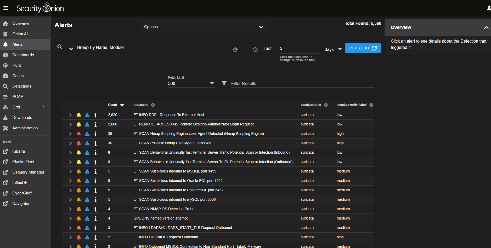
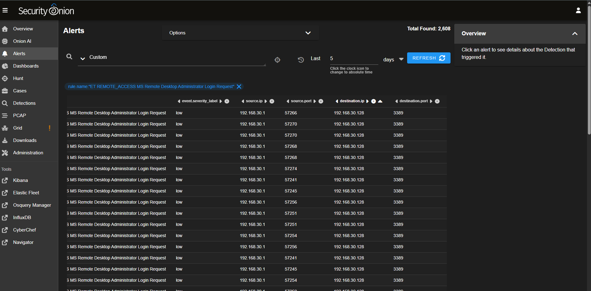
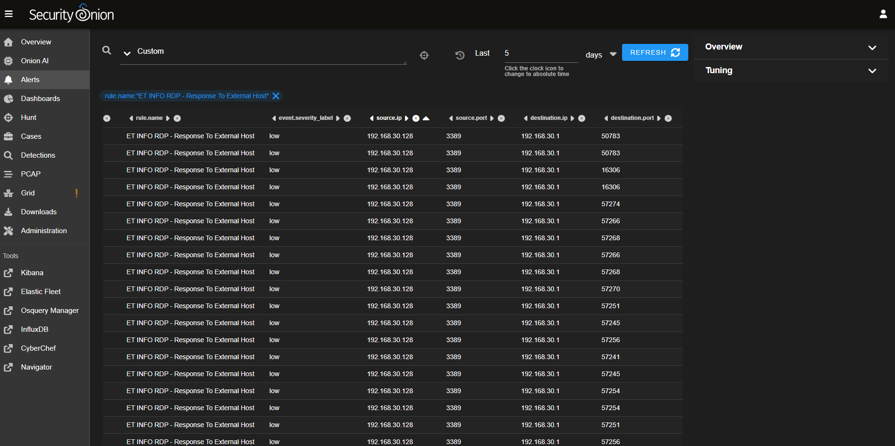
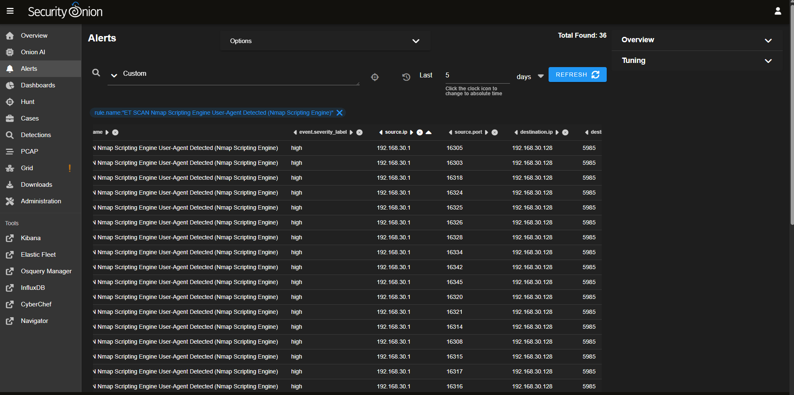

# Project 4: Investigating RDP Abuse and Rogue Host Activity in Security Onion

## Overview

In this lab, I investigated suspicious RDP-related activity in Security Onion after generating reconnaissance and brute-force traffic from a Kali system against a domain controller.

The goal of this phase was to move from attack simulation into defender-side analysis by reviewing alerts, drilling into event details, and tracing repeated suspicious activity back to the same source. Rather than focusing on exploitation itself, this project focused on how a SOC analyst could identify, correlate, and interpret rogue host behavior from network detections and alert telemetry.

This investigation also highlighted an important lab reality: virtualization and interface behavior can affect how source systems are represented in telemetry, which means attribution sometimes requires context and correlation rather than assuming a single static IP will always appear exactly as expected.

---

## Lab Environment

### Systems
- Kali Linux attacker VM
- Windows Server 2022 Domain Controller
- Security Onion

### Tools Used
- Security Onion
- Kibana / Elastic Discover
- Suricata

---

## Objective

Investigate the RDP and brute-force-related detections generated during the previous attack simulation and determine what evidence could be used to identify the suspicious source and understand the activity from a defender perspective.

During this phase, I:

- reviewed Security Onion alerts tied to RDP and brute-force behavior
- drilled into alert details
- identified repeated suspicious source/destination pairs
- pivoted into Kibana / Discover
- correlated multiple alert types associated with the same activity
- documented attribution challenges caused by virtualization and interface behavior
---

## Initial Alerts Observed

After the Hydra and RDP activity from the previous phase, Security Onion generated multiple detections tied to the suspicious behavior.

The most relevant alerts included:

- `ET INFO RDP - Response To External Host`
- `ET REMOTE_ACCESS MS Remote Desktop Administrator Login Request`
- `ET SCAN Behavioral Unusually fast Terminal Server Traffic Potential Scan or Infection (Inbound)`
- `ET SCAN Behavioral Unusually fast Terminal Server Traffic Potential Scan or Infection (Outbound)`
- `ET SCAN RDP Connection Attempt from Nmap`

Together, these alerts suggested a combination of:

- RDP communication
- administrator login-related traffic
- unusually fast terminal server activity
- probing behavior associated with the rogue source

This created enough signal to justify a focused investigation.

---

## Alert Drilldown and Source Identification

I drilled into the alert data to identify the source and destination details behind the suspicious activity.

The alert-level investigation showed repeated traffic tied to:

- source IP: `192.168.30.1`
- destination IP: `192.168.30.128`

The destination IP mapped to the domain controller. The repeated appearance of the same source across related detections made it clear that the activity was not random background noise.

One important wrinkle in this phase was source attribution. Earlier in the lab, the Kali system had also used a manually assigned address on the same segment. By the time of this investigation, the environment had changed enough that the activity was being observed through `192.168.30.1` instead of the earlier manually assigned address. This reinforced a useful lesson: in virtualized lab environments, the IP seen by the defender may reflect adapter state, translation behavior, or interface changes rather than the originally expected attacker-side address.

---

## Kibana Pivot and Investigation Findings

I pivoted into Kibana / Discover using the suspicious source IP observed in the alerts.

A broad search for `192.168.30.1` returned matching documents, which confirmed that the source was present in telemetry beyond the alert list itself. However, the richer host attribution fields I tested, such as host and domain-related fields, were largely sparse or empty in the returned data.

That meant the strongest evidence path in this phase came from correlation across alert telemetry rather than from a clean host-identity field in Discover.

Even without a perfect domain or hostname pivot, the investigation still showed a consistent pattern:

- repeated alert activity from the same suspicious source
- the same destination domain controller
- multiple alert families tied to RDP and scan behavior
- repeated source/destination communication patterns over time

This was enough to support the conclusion that the alerts were associated with the rogue activity generated from the Kali attack simulation.

---

## Correlation Across Alert Types

The strongest part of the investigation came from correlating multiple alert families rather than relying on a single event.

Two views were especially useful:

1. Repeated scan-related detections tied to the same source IP and domain controller destination
2. Repeated RDP response activity showing the domain controller responding over port 3389 within the same communication pattern

This showed that the same traffic relationship appeared across different parts of the alert set, which strengthened the investigation even when some enrichment fields were limited.

From a SOC perspective, this matters because a suspicious source does not need to be identified from one perfect field alone. Repeated correlation across related alerts can still build a strong and defensible case for escalation, triage, or containment.

---

## Key Takeaways

- Multiple related alerts can tell a stronger story than one alert viewed in isolation
- Repeated source and destination patterns are useful for identifying suspicious activity even when enrichment fields are sparse
- RDP-related detections, administrator login request alerts, and scan behavior together create a meaningful investigation path
- Virtualization and interface changes can complicate straightforward source attribution in lab environments
- Defender-side investigation is often about building confidence through correlation, not waiting for one perfect field to solve everything

---

## Screenshots

---

## Conclusion

This phase focused on the defender side of the earlier attack simulation by analyzing how the RDP and brute-force activity appeared in Security Onion.

Although attribution was not perfectly clean due to lab networking changes and interface behavior, repeated correlation across multiple alert types was enough to identify a consistent suspicious source communicating with the domain controller. This made the project valuable not because the telemetry was perfectly neat, but because it reflected the kind of messy, real-world investigation logic analysts often have to use.

The next phase will move from network-side investigation into endpoint tooling detection and credential-access monitoring in Elastic Defend.