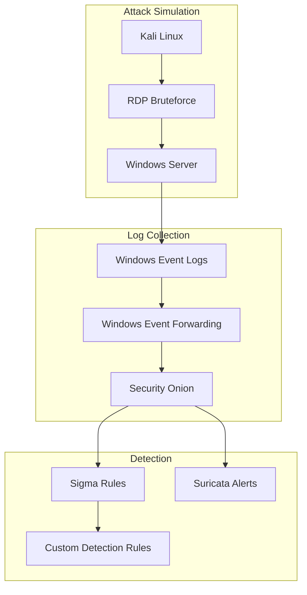
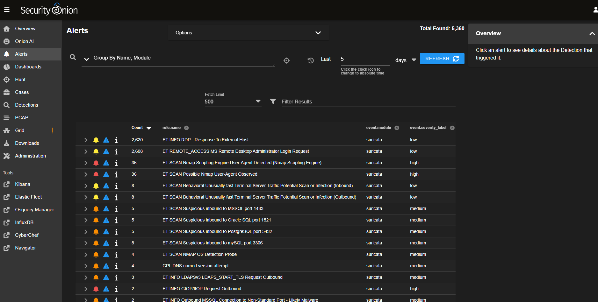
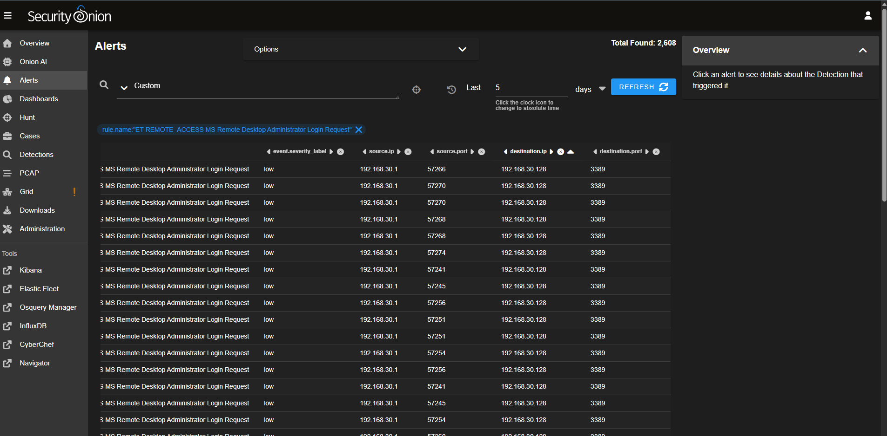
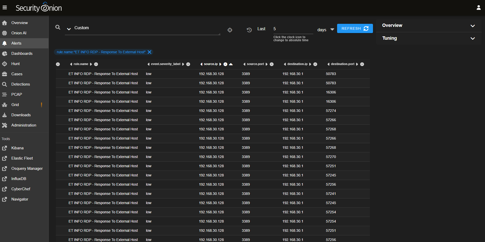
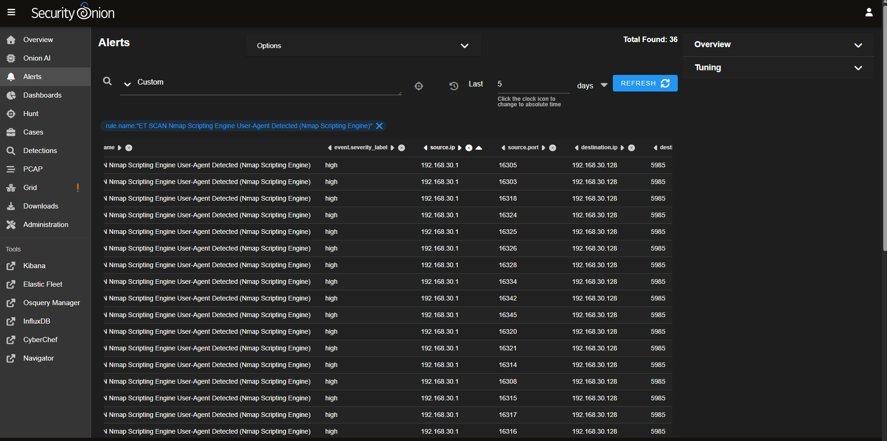

# Investigating RDP Abuse and Rogue Host Activity in Security Onion

This project was completed in an isolated home SOC lab built for Security Onion investigation practice.

---

## Project Overview

This project focuses on investigating RDP-related and scan-related activity in Security Onion after suspicious traffic was generated against a Windows Server domain controller.

The goal was to move from attack simulation into defender-side analysis. Instead of focusing on exploitation, this project focused on reviewing alerts, identifying repeated source and destination patterns, and understanding how suspicious RDP activity appeared in Security Onion.

The investigation showed repeated alert activity involving a domain controller on port `3389`, along with scan-related detections tied to the same suspicious source. It also highlighted a practical lab issue: virtualized networking can affect how attacker traffic appears in telemetry, so source attribution sometimes requires correlation instead of relying on one expected IP address.

---

## Why I Built This Project

RDP activity can generate a large amount of network telemetry, especially during scanning, login attempts, or repeated connection behavior.

I built this lab to practice:

1. Reviewing RDP-related alerts in Security Onion.
2. Identifying source and destination IP patterns.
3. Comparing alert families connected to the same activity.
4. Understanding how Security Onion and Suricata represent RDP traffic.
5. Dealing with imperfect source attribution in a virtual lab.
6. Building an investigation story from repeated evidence instead of one perfect field.

This project helped reinforce that SOC analysis is often about correlation. A single alert may not explain the whole situation, but multiple related alerts can build a stronger picture.

---

## Lab Environment & Architecture

## Architecture

```mermaid
graph TD
    subgraph "Attack Simulation"
        A[Kali Linux] --> B[RDP Bruteforce]
        B --> C[Windows Server]
    end
    
    subgraph "Log Collection"
        D[Windows Event Logs]
        E[Windows Event Forwarding]
        F[Security Onion]
    end
    
    subgraph "Detection"
        G[Sigma Rules]
        H[Suricata Alerts]
        I[Custom Detection Rules]
    end
    
    C --> D
    D --> E
    E --> F
    F --> G
    F --> H
    G --> I
```

*Note: This diagram represents the lab environment and investigation workflow.*

| Component | Details |
|---|---|
| Suspected Source | `192.168.30.1` |
| Domain Controller | `192.168.30.128` |
| RDP Port | `3389` |
| SIEM | Security Onion |
| Detection Engine | Suricata |
| Analysis Interface | Security Onion Alerts / Hunt |

---

## Tools & Technologies Used

| Tool | Purpose |
|---|---|
| Security Onion | Alert review and investigation |
| Suricata | Network detection engine generating alert telemetry |
| Kibana / Elastic | Supporting log review and alert analysis |
| Nmap / RDP activity | Generated suspicious traffic for investigation |

---

## Project Flow

The project followed this sequence:

1. Reviewed RDP-related alerts in Security Onion.
2. Identified repeated traffic involving the domain controller on port `3389`.
3. Reviewed scan-related alerts tied to the same suspicious source.
4. Compared RDP response activity with Nmap-related alert activity.
5. Correlated repeated source and destination patterns.
6. Documented source-attribution issues caused by virtual lab networking.
7. Interpreted the evidence from a defender’s point of view.

---

## Phase 1: RDP Response Activity Review

Security Onion showed repeated RDP response activity involving the domain controller.

## What this proved

The alert view showed repeated alerts named:

`ET INFO RDP - Response To External Host`

The source IP was:

`192.168.30.128`

The source port was:

`3389`

The destination IP was:

`192.168.30.1`

This showed the domain controller responding over RDP to the suspicious source.

This evidence supports RDP-related communication, not proof by itself of successful login or confirmed compromise.

---

## Phase 2: Nmap-Related Alert Drilldown

Security Onion also showed scan-related activity tied to the suspicious source.

## What this proved

The alert drilldown showed repeated Nmap-related detections with:

- Source IP: `192.168.30.1`
- Destination IP: `192.168.30.128`
- Destination port: `5985`
- Severity: High

The rule shown was:

`ET SCAN Nmap Scripting Engine User-Agent Detected (Nmap Scripting Engine)`

This confirmed that the suspicious source was also associated with scan-related activity against the domain controller.

---

## Phase 3: Remote Desktop Login Request Pattern

Another alert family showed repeated Remote Desktop administrator login request traffic.

## What this proved

Security Onion showed repeated alerts named:

`ET REMOTE_ACCESS MS Remote Desktop Administrator Login Request`

The traffic pattern showed:

- Source IP: `192.168.30.1`
- Destination IP: `192.168.30.128`
- Destination port: `3389`

This supported the investigation of RDP-related access behavior against the domain controller.

The screenshot supports repeated RDP login request telemetry. It should not be overstated as proof that authentication succeeded or that the system was compromised.

---

## Phase 4: Correlation Across Alert Families

The strongest evidence came from looking across multiple alert families instead of relying on one alert.

## What this proved

The grouped alert view showed several related alert types, including:

- `ET INFO RDP - Response To External Host`
- `ET REMOTE_ACCESS MS Remote Desktop Administrator Login Request`
- `ET SCAN Nmap Scripting Engine User-Agent Detected`
- `ET SCAN Possible Nmap User-Agent Observed`
- `ET SCAN Behavioral Unusually fast Terminal Server Traffic Potential Scan or Infection`
- `ET SCAN NMAP OS Detection Probe`

The largest alert counts were tied to RDP response and Remote Desktop login request behavior.

This showed that the suspicious activity was not limited to one isolated event. Multiple alert families pointed toward related RDP and scan behavior involving the same domain controller.

---

## Source Attribution Notes

One important lesson from this project was that the source attribution did not appear exactly as expected from earlier lab stages.

Earlier testing used a Kali system with manually assigned addressing. In this investigation, the suspicious source appeared as:

`192.168.30.1`

That does not automatically invalidate the evidence. In virtualized labs, adapter changes, NAT behavior, host-only networks, routing, or interface changes can affect how traffic appears to the monitoring sensor.

Because of that, the investigation relied on repeated correlation:

- Same suspicious source pattern
- Same domain controller destination
- Same RDP destination port
- Related scan and RDP alert families
- Repeated event counts across the alert set

This is a realistic SOC lesson. Attribution is not always clean, especially in labs. The correct response is to document the uncertainty and use the strongest evidence available.

---

## Detection Logic Explained

This investigation used three main ideas:

### 1. Alert family comparison

The activity was reviewed across RDP response alerts, Remote Desktop login request alerts, and Nmap scan alerts.

### 2. Source and destination correlation

The investigation focused on repeated relationships between:

- Suspicious source: `192.168.30.1`
- Domain controller: `192.168.30.128`
- RDP port: `3389`

### 3. Pattern-based confidence

The investigation did not depend on one perfect field. Confidence came from repeated related alerts pointing to the same general activity.

---

## Key Findings & Analysis

### 1. The domain controller showed repeated RDP response activity

Security Onion showed the domain controller responding over port `3389`.

### 2. The suspicious source was tied to scan activity

Nmap-related alerts showed `192.168.30.1` targeting the domain controller.

### 3. Remote Desktop login request telemetry appeared repeatedly

Security Onion showed repeated Remote Desktop administrator login request alerts targeting the domain controller.

### 4. Multiple alert families strengthened the investigation

The correlation across RDP and scan-related alerts made the activity more meaningful than one alert viewed alone.

### 5. Source attribution required caution

The source IP did not line up perfectly with earlier expectations from the lab. The investigation handled this by documenting the issue and relying on repeated correlation.

---

## Limitations

This was a controlled home lab, not a production incident.

Important limitations:

- The screenshots support RDP-related and scan-related alert telemetry, not confirmed compromise.
- The evidence does not prove successful authentication.
- The source IP should be interpreted carefully because of virtual lab networking behavior.
- Host enrichment fields were limited in this phase.
- The investigation relied mainly on alert correlation and source/destination patterns.
- More complete endpoint logs would be needed to confirm login success, process execution, or post-authentication activity.
- A production investigation would require firewall logs, Windows Security logs, endpoint telemetry, and authentication event review.

---

## Improvements for a Future Version

If I expanded this project, I would improve it by:

- Adding Windows Security event logs for RDP authentication review.
- Correlating network detections with endpoint login events.
- Capturing firewall or packet-level evidence for the RDP sessions.
- Documenting the exact Kali network configuration at the time of the test.
- Adding a clearer timeline from scan activity to RDP activity.
- Reviewing whether `192.168.30.1` represented the host, gateway, NAT interface, or adapter behavior.
- Creating a detection rule that groups repeated RDP-related activity by source and destination.

---

## Screenshot Evidence

| Screenshot | What It Shows |
|---|---|
| `Screenshots/01-so-rdp-bruteforce-alerts.png` | RDP response activity involving the domain controller |
| `Screenshots/02-so-alert-drilldown-source-ip.png` | Nmap-related alert drilldown showing source and destination details |
| `Screenshots/03-rdp-alerts-same-source.png` | Repeated Remote Desktop login request activity |
| `Screenshots/04-correlated-scan-alerts-same-source.png` | Multiple alert families tied to related RDP and scan behavior |

---

## Conclusion & Lessons Learned

This project investigated suspicious RDP and scan-related activity in Security Onion.

The strongest finding was not a single perfect alert. It was the repeated correlation across multiple alert families involving the same domain controller and suspicious source pattern.

The project also showed why source attribution needs caution in virtualized labs. Even when the source IP does not appear exactly as expected, repeated alert relationships can still provide useful investigative evidence when the limitations are documented clearly.

---

## Repository Information

**Project**: rdp-abuse-investigation-security-onion
**Author**: Dmokom1  
**Purpose**: Hands-on cybersecurity lab for skill development
**Environment**: Isolated home lab with Windows Server 2022 DC
**Tools**: See "Tools Used" section above

### Usage Notes:
- This repository documents a learning exercise, not production code
- All screenshots are from controlled lab environments
- Techniques demonstrated are for educational purposes only
- Always follow organizational policies and legal guidelines

### Contributing:
While this is primarily a personal learning portfolio, suggestions and feedback are welcome. Please open an issue to discuss improvements.

