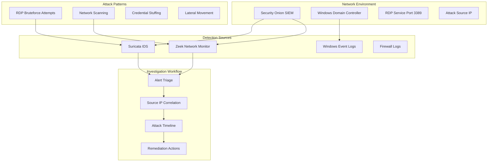

# RDP Abuse Investigation Architecture

```mermaid
graph TD
    subgraph "Network Environment"
        A1[Security Onion SIEM]
        A2[Windows Domain Controller]
        A3[RDP Service Port 3389]
        A4[Attack Source IP]
    end
    
    subgraph "Attack Patterns"
        B1[RDP Bruteforce Attempts]
        B2[Network Scanning]
        B3[Credential Stuffing]
        B4[Lateral Movement]
    end
    
    subgraph "Detection Sources"
        C1[Suricata IDS]
        C2[Zeek Network Monitor]
        C3[Windows Event Logs]
        C4[Firewall Logs]
    end
    
    subgraph "Investigation Workflow"
        D1[Alert Triage]
        D2[Source IP Correlation]
        D3[Attack Timeline]
        D4[Remediation Actions]
    end
    
    A1 --> C1
    A1 --> C2
    A2 --> C3
    B1 --> C1
    B2 --> C2
    C1 --> D1
    C2 --> D1
    D1 --> D2
    D2 --> D3
    D3 --> D4
```
